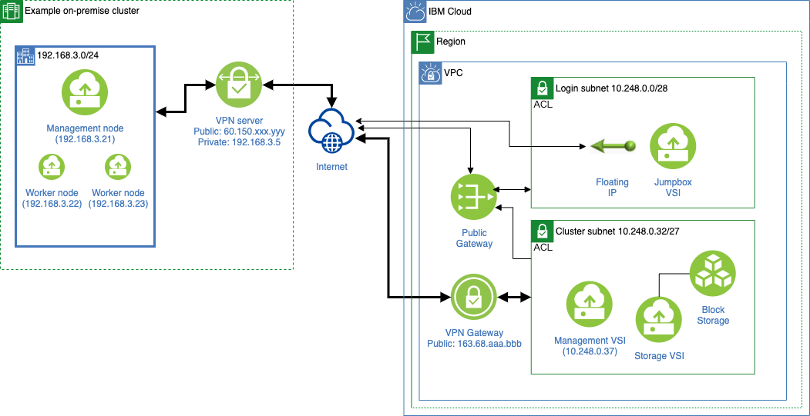

The automation package is implemented as a Terraform template for VPCs on IBM Cloud. Users can configure and start their cluster creation with Schematics, a Terraform platform with Web UI on IBM Cloud. The template is publicly available at [GitHub for IBM Cloud](https://github.com/IBM-Cloud/hpc-cluster-lsf). All you need to create a cloud HPC cluster is to set the GitHub link to a Schematics workspace, edit pre-defined variables, and click several buttons. This tutorial gives a step-by-step guide to creating an example VPN deployment.

Before you begin, make sure to complete the first four steps for [getting started with IBM Spectrum LSF](https://cloud.ibm.com/docs/ibm-spectrum-lsf?topic=ibm-spectrum-lsf-getting-started-tutorial). Also, you need to know the public IP address of your local VPN server, a local CIDR accessing the VPN environment, and a preshared key to authenticate your VPN connection. The preshared key can be any random string.

The following figure is an example of a VPN deployment.

<!---->

<!---->

This example links a VPN gateway to the subnet for LSF nodes. By doing this, local clients can directly access them with private IP addresses (for example, 192.168.3.21 to 10.248.0.37).

1. Configure VPN deployment variables

    Set VPN deployment variables when you [create your workspace](https://cloud.ibm.com/docs/ibm-spectrum-lsf?topic=ibm-spectrum-lsf-creating-workspace). In addition to essential variables to construct your cluster (e.g., `api_key`),  you need to set `vpn_enabled` to be `true`, and then, specify `vpn_peer_address`, `vpn_peer_cidrs`, and `vpn_preshared_key` to be identical to the public IP address for your local VPN server, a local CIDR accessing to the VPN environment, and a preshared key, respectively. In the case of the above example architecture, set `vpn_peer_address` to be `60.150.xxx.yyy`, and `vpn_peer_cidrs` to be `192.168.3.0/24`.

2. Apply plan

    [Apply a plan](/docs/ibm-spectrum-lsf?topic=ibm-spectrum-lsf-applying-plan) to build your cluster with a VPN gateway. After a while, Schematics logs show you essential information to configure your local VPN environment. You can use the Web console to check the log files. They show a line `vpn_config_info =...`, which contains the VPN public IP (`162.133.aaa.bbb`), the connected CIDR (`10.248.0.32/27`), and used UDP ports.

    ```
    2021/10/07 04:06:48 Terraform apply | Outputs:
    2021/10/07 04:06:48 Terraform apply | 
    2021/10/07 04:06:48 Terraform apply | ssh_command = "ssh -J root@163.68.xxx.yyy  lsfadmin@10.248.0.37"
    2021/10/07 04:06:48 Terraform apply | vpc_name = "lsf-cloud-vpc --  - r034-3cdad0f9-42b6-4ce3-b1c5-61c9f3b55cfa"
    2021/10/07 04:06:48 Terraform apply | vpn_config_info = "IP: 163.68.aaa.bbb, CIDR: 10.248.0.32/27, UDP ports: 500, 4500"
    2021/10/07 04:06:48 Command finished successfully.
    2021/10/07 04:06:53 Done with the workspace action
    ```

3. Configure your local VPN environment

    Typical VPN configurations require a public IP address for the local VPN server, a local CIDR, a preshared key, a peer IP address, and a peer CIDR. In the example above, you first need to configure your local VPN server with public IP address, local CIDR, and a preshared key, which are identical to what you specified for `vpn_peer_address`, `vpn_peer_cidr`, and `vpn_preshared_key` at Step 1, respectively. Then, your local VPN configuration needs to add a peer IP address to be `163.68.aaa.bbb` and a peer CIDR to be `10.248.0.32/27` according to the output of Step 2. Finally, UDP ports 500 and 4500 must be accessible from the VPN gateway on IBM Cloud by configuring your local network devices (e.g., routers). For more details on configuring your VPN, see [Connecting to your on-premises network](/docs/vpc?topic=vpc-vpn-onprem-example).

